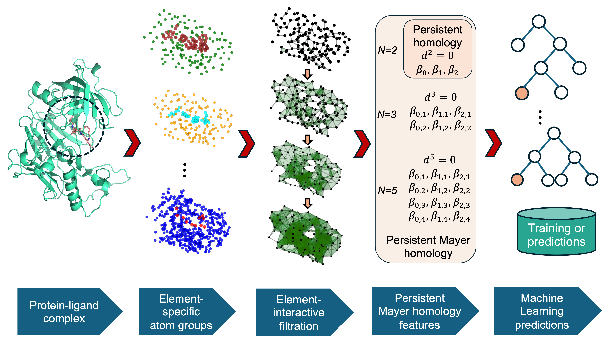

# PMH_Bio

 
<!--  -->

**Title** - Persistent Mayer homology-based machine learning models for protein-ligand binding affinity prediction.

**Authors** - Hongsong Feng, Li Shen, Jian Liu, and Guo-Wei Wei

---

## Table of Contents

- [Table of Contents](#table-of-contents)
- [Introduction](#introduction)
- [Model Architecture](#model-architecture)
- [Prerequisites](#prerequisites)
- [Datasets](#datasets)
- [Modeling with mGLI-based features](#Modeling-with-mGLI-based-features)
    - [Generation of mGLI-based features for protein-ligand complex](#II-Generation-of-mGLI-based-features-for-protein-ligand-complex)
    - [Generation of sequence-based features for protein or small molecules](#IV-Generation-of-sequence-based-features-for-protein-or-small-molecules)

- [Results](#results)
    - [I. Modeling the PDBbind datasets]()
- [License](#license)
- [Citation](#citation)

---

## Introduction
Artificial intelligence-assisted drug design is revolutionizing the pharmaceutical industry. Effective molecular features are crucial for accurate machine learning predictions, and advanced mathematics plays a key role in designing these features. Persistent homology theory, which equips topological invariants with persistence, provides valuable insights into molecular structures. The calculation of Betti numbers is based on differential that typically satisfy \(d^2 = 0\). Our recent work has extended this concept by employing Mayer homology with a generalized differential that satisfies \(d^N = 0\) for \(N \geq 2\), leading to the development of persistent Mayer homology (PMH) theory. This theory offers richer Betti number information across various scales. In this study, we utilize PMH to create a novel multiscale topological featurization approach for molecular representation. These PMH-based molecular features serve as valuable tools for descriptive and predictive analysis in molecular data and machine learning. By integrating these features with machine learning algorithms, we build highly accurate predictive models. Benchmark tests on established protein-ligand datasets, including PDBbind-2007, PDBbind-2013, and PDBbind-2016, demonstrate the superior performance of our models in predicting protein-ligand binding affinities.

> **Keywords**: Persistent homology, Persistent Mayer homology, Protein-ligand binding affinity.

---

## Model Architecture

Schematic illustration of the overall mGLI-based knot data analysis (KDA) platform is shown in below.

Further explain the details in the [paper](https://github.com/WeilabMSU/PMH_Bio), providing context and additional information about the architecture and its components.

---

## Prerequisites

- numpy                     1.21.0
- scipy                     1.7.3
- scikit-learn              1.0.2
- python                    3.10.12
- biopandas                 0.4.1
- Biopython                 1.75

---
## Datasets

| Datasets                |Total    | Training Set                 | Test Set                                             |
|-|-----------------------------|------------------------------|------------------------------                        |
| PDBbind-v2007       |1300 |1105  [Label](https://weilab.math.msu.edu/Downloads/mGLI-KDA/PDBbind.zip)                        | 195 [Label](https://weilab.math.msu.edu/Downloads/mGLI-KDA/PDBbind.zip)                         |
| PDBbind-v2013       |2959|2764  [Label](https://weilab.math.msu.edu/Downloads/mGLI-KDA/PDBbind.zip)                        | 195 [Label](https://weilab.math.msu.edu/Downloads/mGLI-KDA/PDBbind.zip)                         |
| PDBbind-v2016       |4057|3767  [Label](https://weilab.math.msu.edu/Downloads/mGLI-KDA/PDBbind.zip)                        | 290 [Label](https://weilab.math.msu.edu/Downloads/mGLI-KDA/PDBbind.zip)                         |

- PDBbind RawData: the protein-ligand complex structures. Download from [PDBbind database](http://www.pdbbind.org.cn/)
- Label: the .csv file, which contains the protein ID and corresponding binding affinity for PDBbind data.
---

## Modeling the PDBbind datasets

|Datasets                                        | Training Set                  | Test Set| PCC | RMSE (kcal/mol) |
|-------------------------------------------------|-------------                  |---------|-    |-                |
| PDBbind-v2007 [result](./Results)      |1300 |1105  | **0.835** |1.888|
| PDBbind-v2013 [result](./Results)      |2959|2764  | **0.819** |1.930|
| PDBbind-v2016 [result](./Results)      |4057|3767  | 0.857 |1.673|

- Note, twenty gradient boosting regressor tree (GBRT) models were built for each dataset with distinct random seeds such that initialization-related errors can be addressed. The PMH-based features and transformer-based features were paired with GBRT, respectively. The consensus predictions were obtained using predictions from the two types of models. The predictions can be found in the [results](./Results) folder. 
---

## License

This project is licensed under the MIT License - see the [LICENSE](LICENSE) file for details.

---

## Citation

- Hongsong Feng, Li Shen, Jian Liu, and Guo-Wei Wei, "Persistent Mayer homology-based machine learning models for protein-ligand binding affinity prediction"

---
